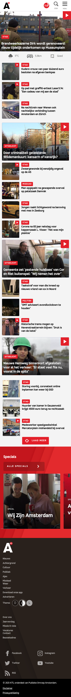
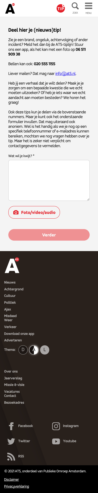
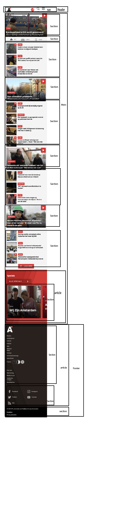
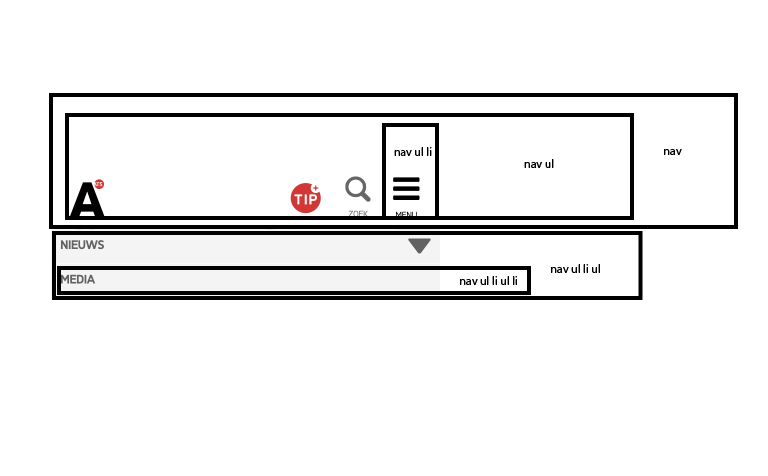
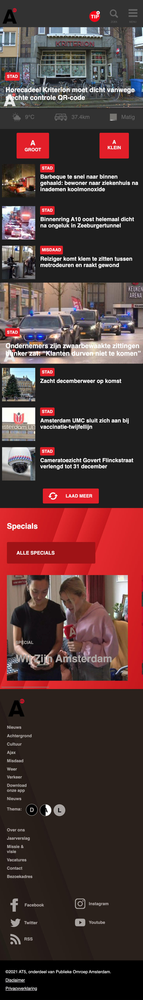
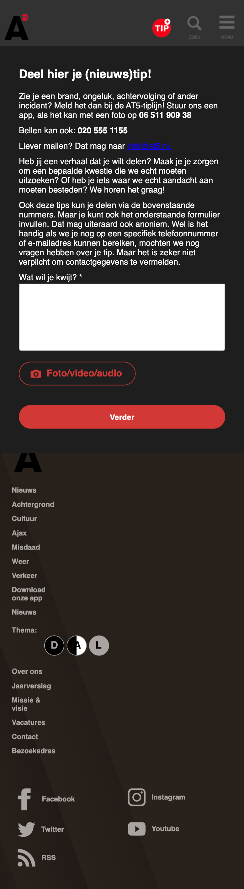

# Procesverslag
Markdown is een simpele manier om HTML te schrijven.  
Markdown cheat cheet: [Hulp bij het schrijven van Markdown](https://github.com/adam-p/markdown-here/wiki/Markdown-Cheatsheet).

Nb. De standaardstructuur en de spartaanse opmaak van de README.md zijn helemaal prima. Het gaat om de inhoud van je procesverslag. Besteedt de tijd voor pracht en praal aan je website.

Nb. Door *open* toe te voegen aan een *details* element kun je deze standaard open zetten. Fijn om dat steeds voor de relevante stuk(ken) te doen.

## Jij

uitwerken voor kick-off werkgroep

### Auteur:
Xavier Ruperink

#### Je startniveau:
Blauw

#### Je focus:
Surface plane (kies uit responsive óf surface plane)
 

## Je website

uitwerken voor kick-off werkgroep

### Je opdracht:
https://www.at5.nl

#### Screenshot(s) van de eerste pagina (small screen): 
Home pagina

#### Screenshot(s) van de tweede pagina (small screen):
Tip pagina

 

## Breakdownschets (week 1)

uitwerken na afloop 2e werkgroep

### de hele pagina: 

### dynamisch deel (bijv menu): 

## Voortgang 1 (week 2)

uitwerken voor 1e voortgang

### Stand van zaken
hier dit ging goed & dit was lastig (neem ook screenshots op van delen van je website en code)
Wat goed ging was het positioneren van de tekst en plaatjes.
Waar ik nog moeite mee had was het toevoegen van icoontjes en ook 
zou ik nog willen leren hoe ik een hamburgermenu kan maken.

### Agenda voor meeting
samen met je groepje opstellen

| Xavier         | Cera               | Noor           | Edward        |
| ---            | ---                | ---            | ---           |
| icoontjes en   | hamburger menu     | foto carrousel | foto carrousel|
| hamburger menu |                    |                |               |
| ...            | ...                | ...            | ...           |

### Verslag van meeting
hier na afloop snel de uitkomsten van de meeting vastleggen

- divs weghalen
- classes weghalen
- h1, h2 en h3 aanpassen

## Voortgang 2 (week 3)

uitwerken voor 2e voortgang

### Stand van zaken
hier dit ging goed & dit was lastig 
het positioneren van tekst gaat al beter. Aan het begin van de week vond ik het ook lastig om mijn divs en classes weg te halen. Uiteindelijk is dit wel gelukt gelukkig. Ook is het mij gelukt om icoontjes toe te voegen.

### Agenda voor meeting
samen met je groepje opstellen

| Xavier                   | Cera                | Noor         | Edward           |
| ---                      | scrollbar           | ---          | ---              |
| hoe achtergrond          | waardoor je tussen  | en ik dit    | darkmode         |
| footer namaken           | fotos kan scrollen  | nog een punt |                  |
| (verschillende kleuren)  | ...                 | ...          | ...              |

### Verslag van meeting
hier na afloop snel de uitkomsten van de meeting vastleggen

- van social media 1 section maken. Nu heb ik namelijk meerdere sections
- hamburger menu toevoegen
- h1 maken van at5 logo
- dark mode beter uitwerken

## Toegankelijkheidstest (week 4)

uitwerken na test in 8e voortgang

#### Toetsenbord test. 
Zodra ik met de tabfunctie bij de ul li kwam van de nieuwsartikelen zag ik telkens 
alleen de boven en onderste lijn van het vierkantje en niet alle vier de kanten.

dit ga ik oplossen door de a href om de li te plakken

#### Handicap test. 
Zodra de website op darkmode gezet werd was het contrast erg slecht van sommige 
icoontjes. Die waren namelijk donker grijsen de achtergrond was iets donkerder
grijs. 

Ik heb dit opgelost door de kleur van de icoontjes iets lichter te maken zodra
dark mode wordt geactiveerd.

#### Screen reader test. 
Zodra je met de screen reader die lijst activeerde met de verschillende h1 en h2's enz
klopte dit niet. Zo had ik bijv linkjes in de footer een h2 gegeven, wat totaal niet de
bedoeling is.

dit is heel makkelijk op te lossen door de h1 en h2tjes enz aan te passen

## Voortgang 3 (week 4)

uitwerken voor 3e voortgang

### Stand van zaken
De buitenkant van mn site was grotendeels af. Het enige wat nog niet goed was, was mijn code. Ik had namelijk erg veel onnodige dingen gebruikt. Ik vond het lastig om 
het te veranderen maar na een beetje puzzelen was het mij wel gelukt.
Ik had bijvoorbeeld in de footer allemaal losse h2tjes. Hier moest ik een list item van maken

### Agenda voor meeting
samen met je groepje opstellen

| Xavier             |  Noor              | Cera           | Edward(ziek)     |
| ---                | ---                | ---            | ---              |
| footer 2e pagina
plakt niet.          | formulier goed     | ruimte tussen  |                  |
| kijken of code     | positioneren       | fotos gelijk   |                  |
| er netjes uit ziet | ...                | maken          | ...              |

### Verslag van meeting
hier na afloop snel de uitkomsten van de meeting vastleggen

- ul li toevoegen in footer
- h5 en h6 veranderder door 'p'
- op twee plekken de code verder laten inspringen
- ...

## Eindgesprek (week 5)

uitwerken voor eindgesprek

### Stand van zaken
Waar ik nog heel erg mee aan het strugglen was, was met het toevoegen van geluid 
aan de knoppen. Uiteindelijk is dit wel gelukt gelukkig. Ook heb ik van alle 
'vieze' codes nette code kunnen maken. Ik ben heel blij dat dit gelukt is.

### Screenshot(s)

hier screenshot(s) van je eindresultaat

## Bronnenlijst

continu bijhouden terwijl je werkt

Nb. Wees specifiek ('css-tricks' als bron is bijv. niet specifiek genoeg).

1. https://www.w3schools.com/css/css_form.asp
2. https://www.frmwrk.nl/blog/hoofdletters-maken-met-css#gref
3. https://youtu.be/X7uTyl8Jsso groei geluid
4. https://youtu.be/8u8s2GibXYo krimp geluid
5. https://www.w3schools.com/howto/howto_js_mobile_navbar.asp
6. https://www.w3schools.com/cssref/sel_firstletter.asp
7. https://www.w3schools.com/colors/colors_rgb.asp

